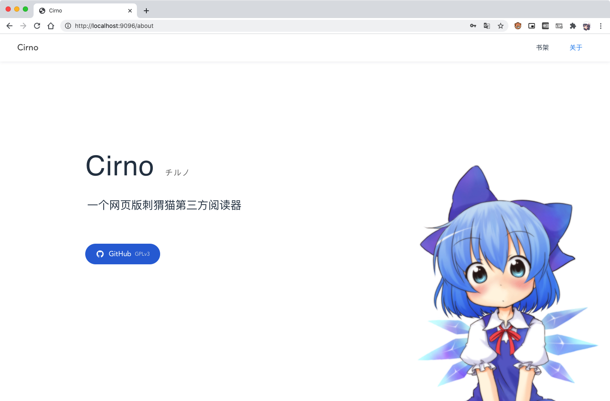
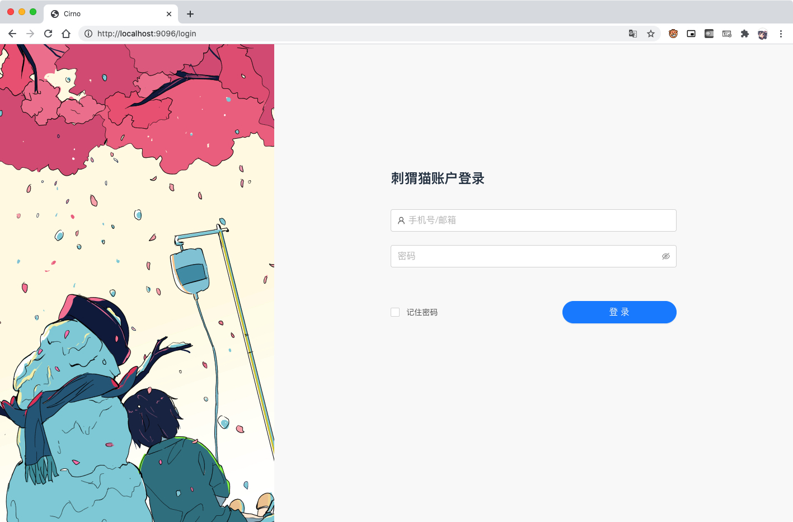
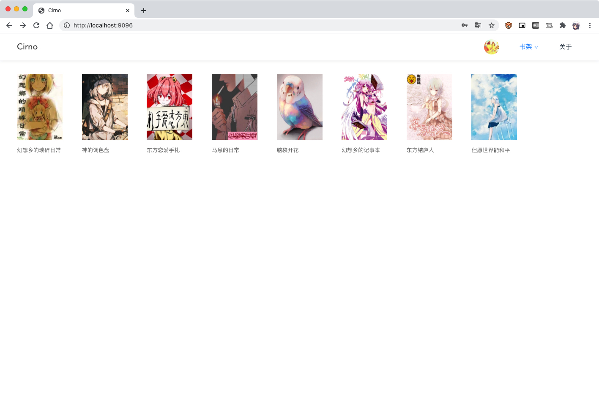
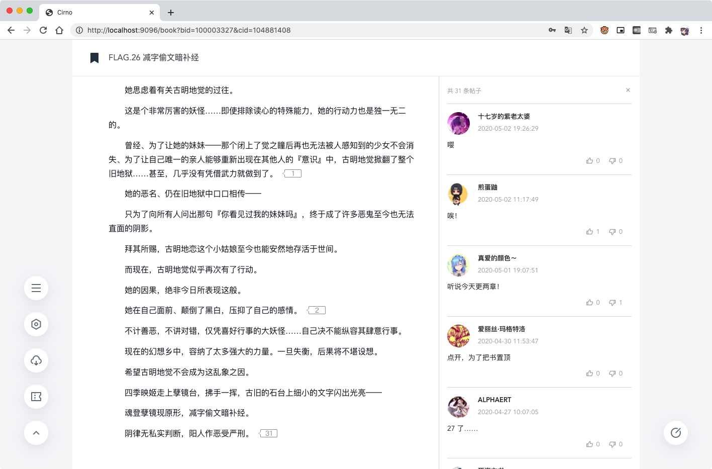

# Cirno

 

## 名称

Cirno 是一个第三方的刺猬猫（欢乐书客）小说阅读器。

> Cirno（チルノ，琪露诺）是一个冰之妖精。在妖精之中她属于最强的那一级别，不过在幻想乡的众多妖怪之中她是比较弱的。琪露诺比较孩子气，是一个「官方认可」的笨蛋，并且拥有「官方」绰号「⑨」。 `——Touhouwiki`

以此命名，大概有着 `「刺猬猫技术部的人都是笨蛋」` 这种程度的意义吧……

## 功能

目前已实现：

- 登入账号
- 多书架读取
- 书架书籍获取
- 自动完成每日任务，领取奖励
- 正文阅读
- 目录跳转
- 读取间贴（弹幕）
- 间贴赞/踩
- 发布间贴
- 付费购买章节
- 投推荐票
- ......

> ~~以上功能均需要搭配 [Cirno-Server](https://github.com/zsakvo/Cirno-Server) 实现，本项目仅负责前端相关功能，具体的 app 接口请求以及数据解密包装等均由对应的后端服务实现，且该服务只起到对官方 App 接口进行包装转发的作用，不会上传您的任何个人信息。~~

## 运行方式：

线上 demo：[Cirno](https://zsakvo.github.io/Cirno/#/)，具体使用参照以下指导。

经过改版，本程序不再需要本地运行后端服务，取而代之的是利用腾讯云 scf（无服务函数）来对接口进行转发和解密。若要使用，请自行申请腾讯云账户，并且开通 scf 相关功能，然后拉取代码后执行命令

```shell
npm install serverless -g
cd scf
yarn
sls deploy
```

按照提示扫码完成验证，等待部署完毕，终端会打印如下信息

```
region: ap-guangzhou
apigw:
  serviceId:   xxxxxxx
  subDomain:   xxxxxxx.gz.apigw.tencentcs.com
  environment: release
  url:         https://xxxxxxx.gz.apigw.tencentcs.com/release/
scf:
  functionName: cirno
  runtime:      Nodejs12.16
  namespace:    default
  lastVersion:  $LATEST
  traffic:      1
```

其中 `url` 字段追加 `api` 即为需要的 api-host（例如 https://xxxxxxx.gz.apigw.tencentcs.com/release/api）
填入前端设置框，验证通过后登陆账号即可开始使用。

## 截图










## Todo

- 阅读界面设置（背景，字体，字号，间距，自动购买等）
- 间贴优化
- 部分界面样式优化
- ......

## 免责

> 作者本人并不提倡盗版书籍，也并不希望本项目被用于侵权。创建本项目一方面是因为在特定情况下并不方便使用 App 进行阅读，但是其网页又有严重的功能缺失；另一方面，其 App 的体验也不是很好。其中的接口均来自于官方 App，理论上并不会导致您的个人信息泄露（但是会把 token 保存在 `.token` 文件中，这么做是因为调试比较方便），如若介意，请自行修改代码或者在您的计算机上移除本项目，谢谢合作。

## 致谢

- [刺猬猫](https://www.ciweimao.com/)
- [微信读书](https://weread.qq.com/)
- [起点读书](https://www.qidian.com/)
- [Vue.js](https://cn.vuejs.org/index.html)
- [Ant Design of Vue](https://www.antdv.com/docs/vue/introduce-cn/)
- [REMIX ICON](https://remixicon.com/)

## 其它

如果觉得有帮助不妨点个 star 呀（<ゝ ω・）☆

---


